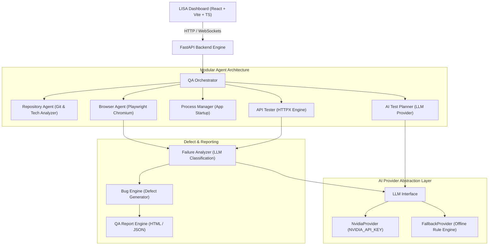

# LISA — Learning & Intelligent Software Assurance

> **"Your AI Software QA Engineer."**

LISA is a fully functional, autonomous AI-powered software QA testing platform. Given an authorized GitHub repository URL, LISA clones the project, analyzes its technology stack and modules, generates structured AI test plans, manages local application background processes, executes Playwright browser tests and HTTP API tests, performs failure root-cause analysis, and generates comprehensive QA executive reports.

---

## Architecture Diagram



---

## Features

- **Autonomous Repository Analysis**: Clones open-source repositories and auto-detects language(s), frontend/backend frameworks, build systems, database engines, and startup commands.
- **AI Test Planner**: Generates structured functional, negative, boundary, UI, and API test cases with Pydantic output validation.
- **Real Playwright Browser Automation**: Launches real Chromium browser instances to execute actions (`open_url`, `click`, `type_text`, `get_page_text`), capturing console logs, network requests, and step screenshots.
- **HTTP API Testing**: Executes GET, POST, PUT, PATCH, and DELETE automated endpoint tests.
- **AI Failure & Root Cause Classification**: Categorizes test failures into `APPLICATION_BUG`, `TEST_BUG`, `ENVIRONMENT_FAILURE`, `NETWORK_FAILURE`, or `DEPENDENCY_FAILURE`.
- **Structured Defect Engine**: Generates bug reports complete with Severity (`Critical`, `High`, `Medium`, `Low`), Priority (`P0`, `P1`, `P2`, `P3`), steps to reproduce, and regression test recommendations.
- **Human Approval System**: Gated human approval before external GitHub issue or pull request creation.
- **Real-Time Log Streaming**: Streams live terminal updates (`✓ Repository cloned`, `Running TC-AUTH-001...`, `✗ Defect detected`) over WebSockets.
- **LLM Abstraction Layer**: Defaults to NVIDIA API (`NVIDIA_API_KEY`), seamlessly switching to `FallbackProvider` offline or without API credits.

---

## Tech Stack

| Layer | Technologies |
| :--- | :--- |
| **Backend** | Python 3.12+, FastAPI, SQLAlchemy, AsyncIO, SQLite (`aiosqlite`), Pydantic v2 |
| **Frontend** | React, Vite, TypeScript, Tailwind CSS, Lucide Icons, WebSockets |
| **Browser Engine** | Playwright Chromium Headless |
| **AI LLM Engine** | NVIDIA API (`meta/llama-3.3-70b-instruct`) with Fallback Abstraction Layer |
| **Testing** | `pytest`, `pytest-asyncio` |

---

## Installation & Setup

### 1. Backend Setup
```bash
cd backend
python -m venv venv
# On Windows PowerShell:
.\venv\Scripts\activate
# On Linux/macOS:
# source venv/bin/activate

pip install -r requirements.txt
playwright install chromium
```

### 2. Frontend Setup
```bash
cd frontend
npm install
npm run build
```

### 3. Running LISA
Start the backend server:
```bash
cd backend
python -m uvicorn app.main:app --reload --port 8000
```
Start the frontend development server:
```bash
cd frontend
npm run dev
```

---

## Configuration

Copy `.env.example` to `.env`:
```env
NVIDIA_API_KEY=nvapi-...
DATABASE_URL=sqlite+aiosqlite:///./lisa.db
MAX_TEST_STEPS=50
MAX_TEST_TIME=600
LOG_LEVEL=INFO
```

---

## Docker Deployment

Build and run LISA using Docker Compose:
```bash
docker-compose up --build
```

---

## Roadmap

- [x] Repository analysis & tech stack detection
- [x] AI test plan & structured test case generation
- [x] Playwright browser test execution & screenshot evidence
- [x] Failure analysis & bug engine classification
- [x] Real-time WebSocket log streaming
- [x] QA executive report generation (HTML/JSON)
- [x] Human approval system for external GitHub actions
- [ ] API autonomous exploration
- [ ] Database validation engine
- [ ] AI-generated regression test code output
- [ ] GitHub issue & PR automated integration
- [ ] CI/CD pipeline runner

---

## License

MIT License. Developed for autonomous software assurance.
